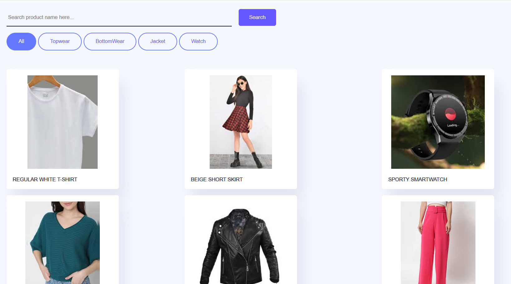

<!-- Product Filter and Search

#Overview
This project is a lightweight frontend demo showcasing how to build a product listing interface with client‑side filtering and search functionality using only HTML, CSS, and JavaScript.Users can search by name and filter by categories via toggle buttons.

#Features
-Dynamic Rendering: Products are loaded from a JavaScript data array and rendered as cards.
-Live Search: Text input allows real-time filtering by product name.
-Category Filters: Clickable buttons enable multi-select filtering (e.g. “Salmon”, “Shrimp”, etc.) 
Google for Developers.
-Responsive Design: Uses CSS Grid and media queries to adjust layout across screen sizes.
-Error Handling: Handles missing images gracefully with fallback styles.

#Technical Stack
-HTML5 for markup structure.
-CSS3 for layout, styling, and responsive behavior.
-JavaScript for:
   -Data modeling (products.data array)
   -DOM manipulation (creating cards, attaching event listeners)
   -State management (tracking active filters)
   -Filtering logic based on search text and selected categories 

#Installation
-Clone or download the repository.
-Place index.html, styles.css, script.js, and asset files (/images, /icons) together.
-Open index.html in a browser to view the project.

#Usage
-Use the search box to filter products by name instantly.
-Click on category buttons to filter products by category; multiple filters can be      activated.
-Deselect a category to reset that filter; when no filters are active, all products are shown.

Assets/Responsive-UI.png
Assets/Filter example.png

#Future Enhancements
-Implement pagination for long product lists.
-Add sorting options (price, popularity, etc.).
-Introduce CSS transitions for smooth card appearance/exit.
-Fetch product data dynamically from an external API or JSON file.
-Enhance accessibility with ARIA attributes and keyboard navigation.
 -->
# Product Filter and Search

## 🧩 Overview
This project is a lightweight frontend demo showcasing how to build a product listing interface with client-side filtering and search functionality using only **HTML**, **CSS**, and **JavaScript**.  
Users can search by name and filter by categories via toggle buttons.

---

## 🚀 Features

- **Dynamic Rendering**  
  Products are loaded from a JavaScript array and rendered as cards.

- **Live Search**  
  Search input allows real-time filtering by product name.

- **Category Filters**  
  Clickable buttons enable category-based filtering (e.g., Topwear, Bottomwear, Jacket, Watch).

- **Responsive Design**  
  Uses CSS Grid and media queries to adapt across devices.

- **Error Handling**  
  Handles missing images gracefully using fallback styles.

---

## 🛠️ Technical Stack

- **HTML5** – markup structure  
- **CSS3** – styling and responsive layout  
- **JavaScript** – for:
  - Product data structure (`products.data` array)
  - DOM manipulation (creating product cards)
  - Filtering/searching functionality
  - Managing category state

---

## 📦 Installation

1. Clone or download the repository.
2. Ensure the following files are in the same directory:
   - `index.html`
   - `style.css`
   - `script.js`
   - `Assets/` folder (for images/screenshots)
3. Open `index.html` in any modern browser.

---

## 🧪 Usage

- Use the **search box** to filter products by name.
- Click on **category buttons** to show only matching products.
- Click "All" or clear the search to reset filters.

---

## 📸 Screenshots

| Responsive UI | Category Filter Example |
|---------------|-------------------------|
|  |  |

---

## 🔮 Future Enhancements

- Pagination for longer product lists  
- Sorting options (e.g., by price or popularity)  
- Smooth card transitions using CSS  
- Load data from an external API or JSON  
- Accessibility improvements with ARIA roles  

---

## 📄 License

This project is for educational/demo purposes and open for extension or modification.
